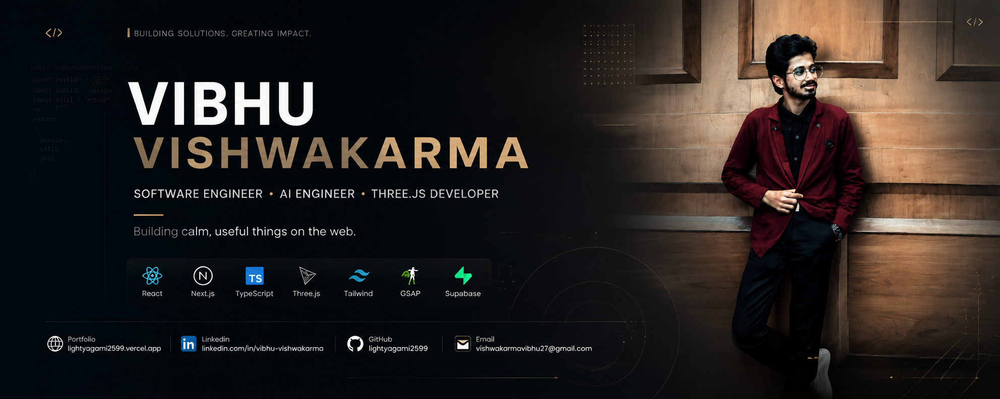
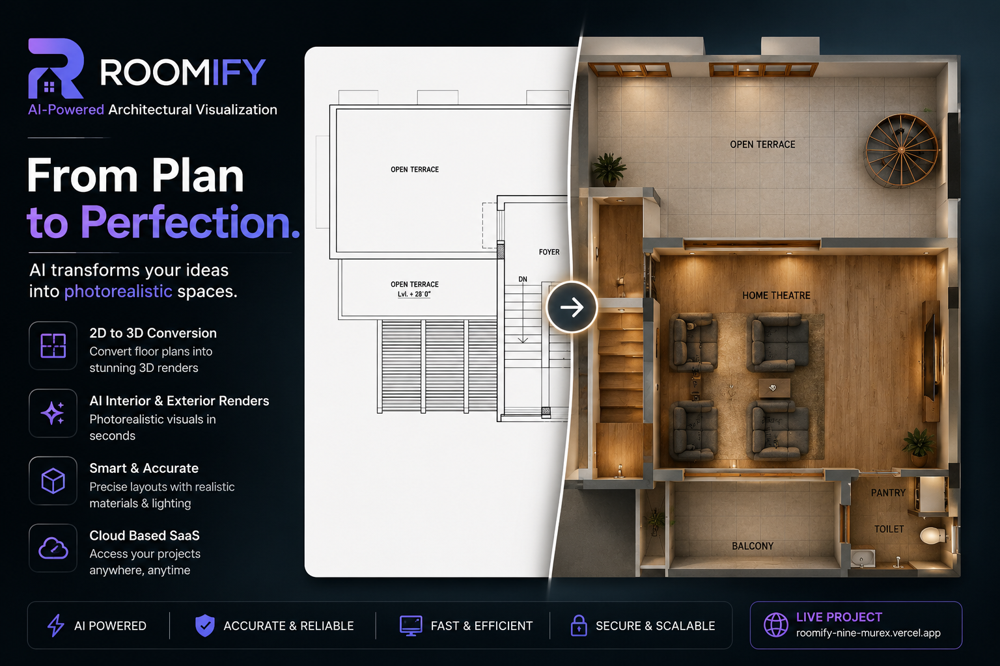
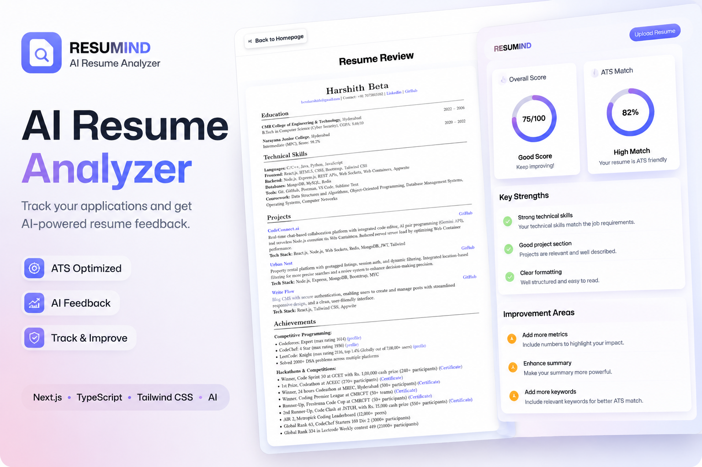
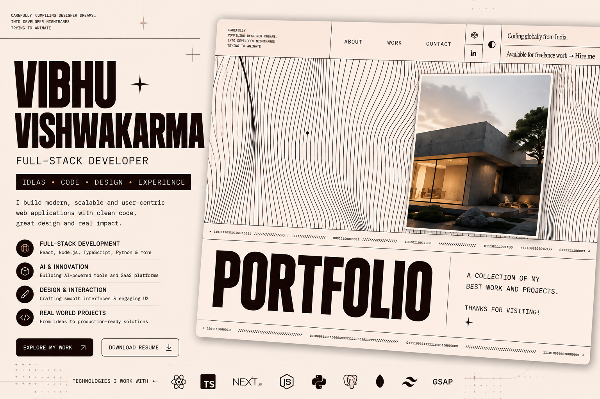
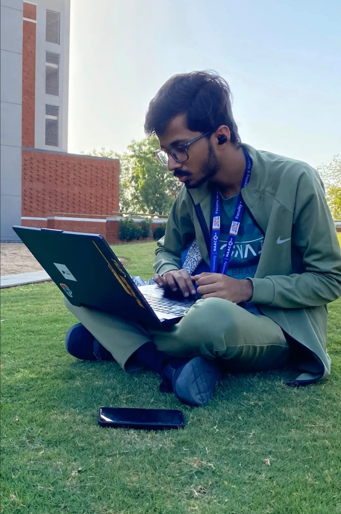
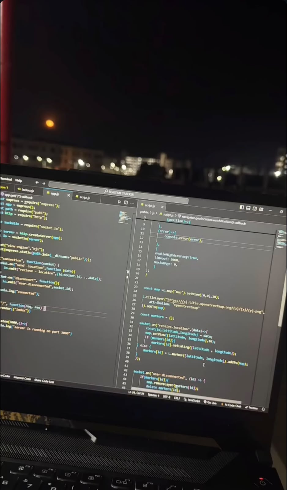
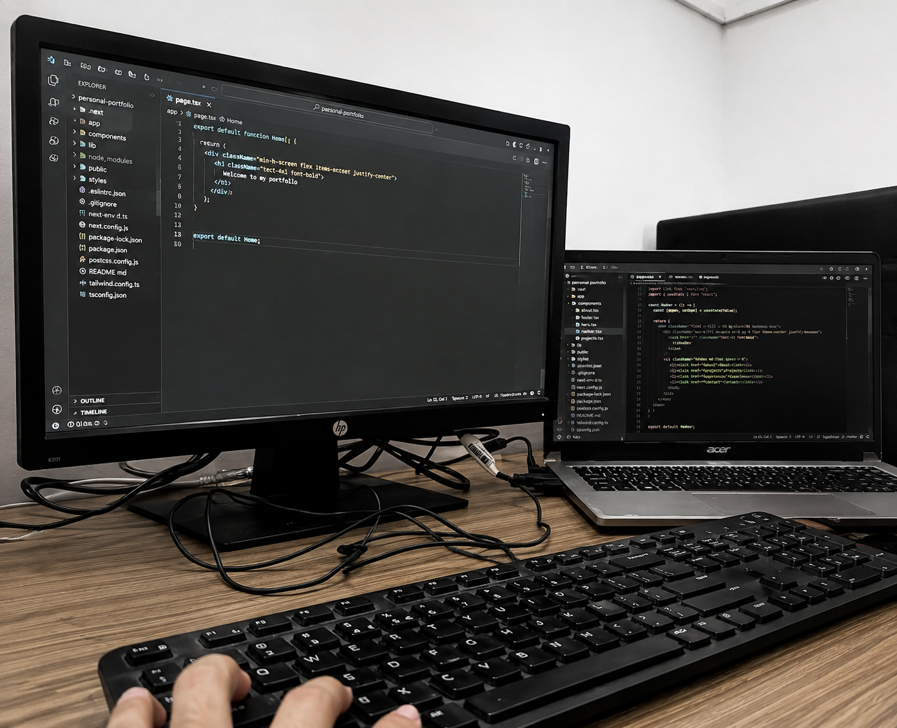

<div align="center">

<p align="center">
  
</p>
# ✦ Vibhu Vishwakarma ✦

**Software Engineer · Building calm, useful things on the web**

[](https://lightyagami2599.vercel.app/)
[](https://www.linkedin.com/in/vibhu-vishwakarma/)
[](https://github.com/lightyagami2599)
[](mailto:vishwakarmavibhu27@gmail.com)
[](assets/Vibhu_Resume.pdf)

</div>

---

```bash
vishwakarmavibhu27@gmail.com ~ % whoami
> Vibhu Vishwakarma — full-stack developer, design-minded, ships fast.
```

## 🧭 About Me

- 🎓 Engineering student, learning by building in public
- 🛠️ I like clean interfaces, sensible backends, and tools that feel calm
- 🌱 Currently exploring AI-powered products and 3D web experiences
- 📫 Reach me at **vishwakarmavibhu27@gmail.com**

---

## 🗓️ My Journey

| Year | Milestone |
|------|-----------|
| 2023 | First lines of code — HTML, CSS, JS |
| 2024 | React, Node & my first real projects |
| 2025 | AI tools, 3D web, shipping live products |
| 2026 | Building polished, production-grade apps |

---

## 🚀 Featured Projects

### 🏠 Roomify — Floor plan to 3D render
<a href="https://roomify-nine-murex.vercel.app/"></a>

Turn architectural floor plans into interactive 3D renders.

[🌐 Live Demo](https://roomify-nine-murex.vercel.app/) · [💻 Code](https://github.com/lightyagami2599)

---

### 🧠 Resumind — AI Resume Analyzer
<a href="https://ai-resume-analyzer-five-weld.vercel.app/"></a>

AI-powered resume feedback with ATS scoring and actionable insights.

[🌐 Live Demo](https://ai-resume-analyzer-five-weld.vercel.app/) · [💻 Code](https://github.com/lightyagami2599)

---

### 🎨 Portfolio — Personal site
<a href="https://new-portfolio-gules-nine-63.vercel.app/"></a>

My personal portfolio — motion, story, and craft.

[🌐 Live Demo](https://new-portfolio-gules-nine-63.vercel.app/) · [💻 Code](https://github.com/lightyagami2599)

---

## 🧰 Tech Stack


---

## ✅ Currently Building

- [x] Roomify — 3D floor plan renderer
- [x] Resumind — AI resume analyzer
- [ ] A calmer developer toolkit
- [ ] Writing more, shipping more

---

## 📊 GitHub Stats

<div align="center">


</div>

---

## 📸 Tiny Memories

| Campus | Setup | Workspace |
|:--:|:--:|:--:|
|  |  |  |
| *learning outside* | *late night code* | *the desk* |

---

<div align="center">

> *"Build quietly. Ship consistently."*

```bash
vishwakarmavibhu27@gmail.com ~ % exit
```

**[✦ Visit my live site → lightyagami2599.vercel.app ✦](https://lightyagami2599.vercel.app/)**

</div>
